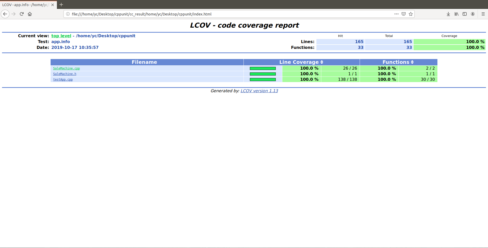
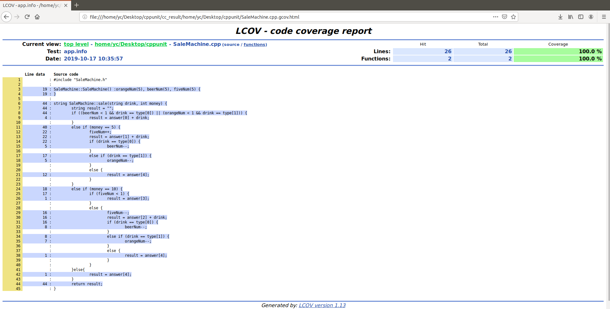

# Linux 下 CppUnit + gcov + lcov 代码覆盖测试

### 安装 CppUnit

1. [下载cppunit源码](https://sourceforge.net/projects/cppunit/files/cppunit/1.12.1/cppunit-1.12.1.tar.gz/download)

2. **解压cppunit-1.12.1.tar.gz**

3. **cd cppunit-1.12.1**

4. **运行 ./configure**

   ***若出现如下报错***

   ```bash
   g++ -g -O2 -o .libs/DllPlugInTester DllPlugInTester.o CommandLineParser.o -ldl ../../src/cppunit/.libs/libcppunit.so -lm
   ../../src/cppunit/.libs/libcppunit.so: undefined reference to `dlsym'
   ../../src/cppunit/.libs/libcppunit.so: undefined reference to `dlopen'
   ../../src/cppunit/.libs/libcppunit.so: undefined reference to `dlclose'
   ```

   ***运行 ./configure LDFLAGS='-ldl'***

5. **make**

6. **make install**

7. **编写测试程序**

   ```c++
   testApp.cpp
   #include <iostream>
    
   #include <cppunit/TestRunner.h>
   #include <cppunit/TestResult.h>
   #include <cppunit/TestResultCollector.h>
   #include <cppunit/extensions/HelperMacros.h>
   #include <cppunit/BriefTestProgressListener.h>
   #include <cppunit/extensions/TestFactoryRegistry.h>
    
    
   class Test : public CPPUNIT_NS::TestCase
   {
    CPPUNIT_TEST_SUITE(Test);
    CPPUNIT_TEST(testHelloWorld);
      CPPUNIT_TEST_SUITE_END();
    
    public:
      void setUp(void) {}
      void tearDown(void) {}
    
    protected:
      void testHelloWorld(void) { std::cout << "Hello, world!" << std::endl; }
    };
    
    CPPUNIT_TEST_SUITE_REGISTRATION(Test);
    
    int main( int argc, char **argv )
    {
      // Create the event manager and test controller
      CPPUNIT_NS::TestResult controller;
    
      // Add a listener that colllects test result
      CPPUNIT_NS::TestResultCollector result;
    controller.addListener( &result );       
    
      // Add a listener that print dots as test run.
      CPPUNIT_NS::BriefTestProgressListener progress;
      controller.addListener( &progress );     
    
      // Add the top suite to the test runner
      CPPUNIT_NS::TestRunner runner;
      runner.addTest( CPPUNIT_NS::TestFactoryRegistry::getRegistry().makeTest() );
      runner.run( controller );
    
      return result.wasSuccessful() ? 0 : 1;
    }
   ```
   
8. **编译、运行（两种方法）**
   
   (a) 链接静态库
   
   ```bash
   # 编译：
   g++ -L/usr/local/lib/libcppunit.a testApp.cpp -lcppunit -ldl -o testApp
   # 运行：
   ./testApp
   # 结果：
   : OK
   ```
   
   (b) 链接动态库
   
   ```bash
   # 编译：
   g++ testApp.cpp -lcppunit -ldl -o testApp
   # 运行：
   ./testApp
   # 结果：
   Test:: : OK
   ```

### 编写待测试类

***《软件测试——基于问题驱动模式》P123实验4 单元测试覆盖率分析实验***

**类实现需求**

```bash
售货机只出售两种饮料：啤酒和橙汁（价格都是5元），只接收5元和10元的纸币。啤酒、橙汁和零钱都有初始值，这里设置为5。
如果成功出售饮料，sale()返回”请取走啤酒“”请取走橙汁“。
没有饮料，退回钱，sale()返回”很抱歉，没有啤酒“或”很抱歉，没有橙汁“。
输出饮料，成功找钱，sale()返回”拿好5元，请取走啤酒“或”拿好5元，请取走橙汁“。
没有零钱找，sale()返回”没有零钱找，退您10元“。
输入不正确，sale()返回”错误指令！“。
```

**SaleMachine.h**

```c++
#include <string>
using namespace std;

class SaleMachine
{
public:
    SaleMachine();
    string sale(string drink, int money);
    int orangeNum, beerNum, fiveNum;

private:
    string answer[5] = {"很抱歉，没有", "请取走", "拿好5元，请取走", "没有零钱找，退您10元", "错误指令！"};
    string type[2] = {"beer", "orange"};
};
```

**SaleMachine.cpp**

```c++
#include "SaleMachine.h"

SaleMachine::SaleMachine() :orangeNum(5), beerNum(5), fiveNum(5) {
}

string SaleMachine::sale(string drink, int money) {
	string result = "";
	if ((beerNum < 1 && drink == type[0]) || (orangeNum < 1 && drink == type[1])) {
		result = answer[0] + drink;
	}
	else if (money == 5) {
		fiveNum++;
		result = answer[1] + drink;
		if (drink == type[0]) {
			beerNum--;
		}
		else if (drink == type[1]) {
			orangeNum--;
		}
		else {
			result = answer[4];
		}
	}
	else if (money == 10) {
		if (fiveNum < 1) {
			result = answer[3];
		}
		else {
			fiveNum--;
			result = answer[2] + drink;
			if (drink == type[0]) {
				beerNum--;
			}
			else if (drink == type[1]) {
				orangeNum--;
			}
			else {
				result = answer[4];
			}
		}
	}else{
		result = answer[4];
	}
	return result;
}
```

### 编写测试程序

```c++
#include <iostream>

#include <cppunit/TestRunner.h>
#include <cppunit/TestResult.h>
#include <cppunit/TestResultCollector.h>
#include <cppunit/extensions/HelperMacros.h>
#include <cppunit/BriefTestProgressListener.h>
#include <cppunit/extensions/TestFactoryRegistry.h>

#include "SaleMachine.h"

using namespace std;

class Test : public CPPUNIT_NS::TestCase
{
    CPPUNIT_TEST_SUITE(Test);

    CPPUNIT_TEST(TestMethod1);
    CPPUNIT_TEST(TestMethod2);
    CPPUNIT_TEST(TestMethod3);
    CPPUNIT_TEST(TestMethod4);
    CPPUNIT_TEST(TestMethod5);
    CPPUNIT_TEST(TestMethod6);
    CPPUNIT_TEST(TestMethod7);
    CPPUNIT_TEST(TestMethod8);

    CPPUNIT_TEST_SUITE_END();

public:
    void setUp(void) {}
    void tearDown(void) {}

protected:
    void TestMethod1();
    void TestMethod2();
    void TestMethod3();
    void TestMethod4();
    void TestMethod5();
    void TestMethod6();
    void TestMethod7();
    void TestMethod8();

private:
    string res[5] = {"很抱歉，没有", "请取走", "拿好5元，请取走", "没有零钱找，退您10元", "错误指令！"};
    SaleMachine sm;
    string drink;
};

void Test::TestMethod1()
{
    drink = "cola";
    CPPUNIT_ASSERT_EQUAL(sm.sale(drink, 5), res[4]);
}

void Test::TestMethod2()
{
    drink = "beer";
    CPPUNIT_ASSERT_EQUAL(sm.sale(drink, 5), res[1] + drink);
    CPPUNIT_ASSERT_EQUAL(sm.sale(drink, 5), res[1] + drink);
    CPPUNIT_ASSERT_EQUAL(sm.sale(drink, 5), res[1] + drink);
    CPPUNIT_ASSERT_EQUAL(sm.sale(drink, 5), res[1] + drink);
    CPPUNIT_ASSERT_EQUAL(sm.sale(drink, 5), res[1] + drink);

    CPPUNIT_ASSERT_EQUAL(sm.sale(drink, 5), res[0] + drink);
}

void Test::TestMethod3()
{
    drink = "orange";
    CPPUNIT_ASSERT_EQUAL(sm.sale(drink, 5), res[1] + drink);
    CPPUNIT_ASSERT_EQUAL(sm.sale(drink, 5), res[1] + drink);
    CPPUNIT_ASSERT_EQUAL(sm.sale(drink, 5), res[1] + drink);
    CPPUNIT_ASSERT_EQUAL(sm.sale(drink, 5), res[1] + drink);
    CPPUNIT_ASSERT_EQUAL(sm.sale(drink, 5), res[1] + drink);
    
    CPPUNIT_ASSERT_EQUAL(sm.sale(drink, 5), res[0] + drink);
}

void Test::TestMethod4()
{
    drink = "beer";
    CPPUNIT_ASSERT_EQUAL(sm.sale(drink, 11), res[4]);
}

void Test::TestMethod5()
{
    drink = "beer";
    CPPUNIT_ASSERT_EQUAL(sm.sale(drink, 10), res[2] + drink);
    CPPUNIT_ASSERT_EQUAL(sm.sale(drink, 10), res[2] + drink);
    CPPUNIT_ASSERT_EQUAL(sm.sale(drink, 10), res[2] + drink);
    CPPUNIT_ASSERT_EQUAL(sm.sale(drink, 10), res[2] + drink);
    CPPUNIT_ASSERT_EQUAL(sm.sale(drink, 10), res[2] + drink);

    CPPUNIT_ASSERT_EQUAL(sm.sale(drink, 10), res[0] + drink);
}

void Test::TestMethod6()
{
    drink = "orange";
    CPPUNIT_ASSERT_EQUAL(sm.sale(drink, 10), res[2] + drink);
    CPPUNIT_ASSERT_EQUAL(sm.sale(drink, 10), res[2] + drink);
    CPPUNIT_ASSERT_EQUAL(sm.sale(drink, 10), res[2] + drink);
    CPPUNIT_ASSERT_EQUAL(sm.sale(drink, 10), res[2] + drink);
    CPPUNIT_ASSERT_EQUAL(sm.sale(drink, 10), res[2] + drink);

    CPPUNIT_ASSERT_EQUAL(sm.sale(drink, 10), res[0] + drink);
}

void Test::TestMethod7()
{
    drink = "cola";
    CPPUNIT_ASSERT_EQUAL(sm.sale(drink, 10), res[4]);
}

void Test::TestMethod8()
{
    drink = "orange";
    CPPUNIT_ASSERT_EQUAL(sm.sale(drink, 10), res[2] + drink);
    CPPUNIT_ASSERT_EQUAL(sm.sale(drink, 10), res[2] + drink);
    drink = "beer";
    CPPUNIT_ASSERT_EQUAL(sm.sale(drink, 10), res[2] + drink);
    CPPUNIT_ASSERT_EQUAL(sm.sale(drink, 10), res[2] + drink);
    CPPUNIT_ASSERT_EQUAL(sm.sale(drink, 10), res[2] + drink);

    CPPUNIT_ASSERT_EQUAL(sm.sale(drink, 10), res[3]);
}

CPPUNIT_TEST_SUITE_REGISTRATION(Test);

int main(int argc, char **argv)
{
    // Create the event manager and test controller
    CPPUNIT_NS::TestResult controller;

    // Add a listener that colllects test result
    CPPUNIT_NS::TestResultCollector result;
    controller.addListener(&result);

    // Add a listener that print dots as test run.
    CPPUNIT_NS::BriefTestProgressListener progress;
    controller.addListener(&progress);

    // Add the top suite to the test runner
    CPPUNIT_NS::TestRunner runner;
    runner.addTest(CPPUNIT_NS::TestFactoryRegistry::getRegistry().makeTest());
    runner.run(controller);

    return result.wasSuccessful() ? 0 : 1;
}
```

### 编译、运行

```bash
g++ -fprofile-arcs -ftest-coverage testApp.cpp SaleMachine.h SaleMachine.cpp -lcppunit -ldl -o testApp
./testApp
gcov SaleMachine.cpp
lcov -c -d ./ -o app.info
genhtml app.info -o cc_result
```

### 查看可视化页面

​		上面几条命令执行成功后，在目录下会多出一个目录**cc_result**，进入该目录，用浏览器打开**index.html**即可查看覆盖率等信息




